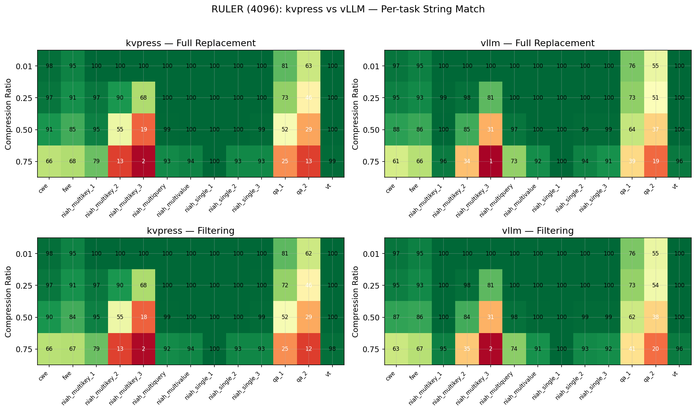
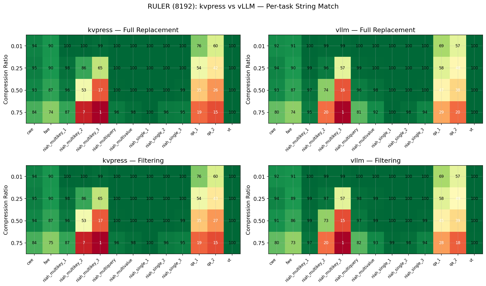
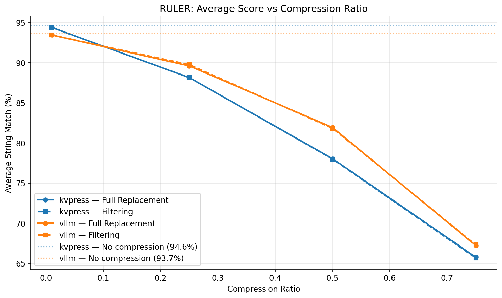
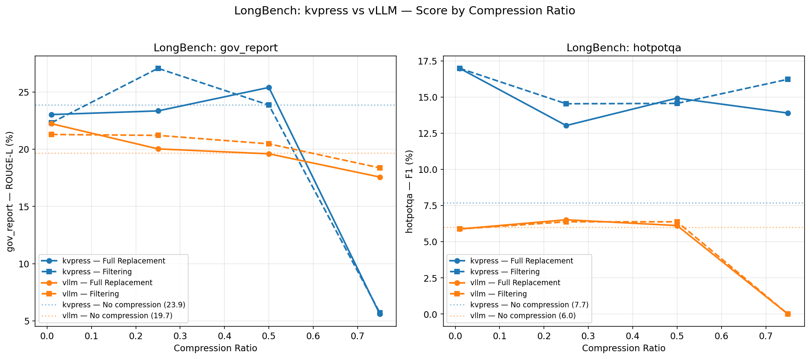
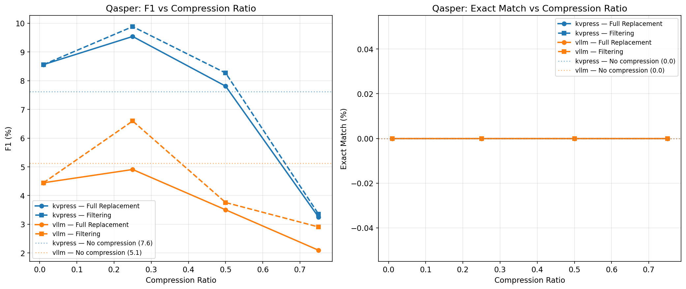

# KeyDiff compression with vLLM

At the time of writing, [vLLM](https://github.com/vllm-project/vllm), a high-throughput inference engine built around PagedAttention, does not yet support KV eviction algorithms.

We developed two implementations of the KeyDiff algorithm on a [v0.18.0 fork](https://github.com/fax4ever/vllm/tree/fax-0.18), based on the [v0.18.0 tag](https://github.com/vllm-project/vllm/releases/tag/v0.18.0):

1. The classic implementation described in the KeyDiff paper. This can be configured by running vLLM with the `kv_compression_algorithm` and `kv_compression_ratio` parameters. For instance:

    ```python
    vLLM_args = {
        "model": MODEL_NAME,
        "dtype": "auto",
        "gpu_memory_utilization": 0.90,
        "trust_remote_code": True,
        "attention_config": {"backend": "FLASH_ATTN"},
        "kv_compression_algorithm": "full_replacement",
        "kv_compression_ratio": cr,
        "enable_prefix_caching": False,
    }
    ```

The algorithm is detailed in: [keydiff-vllm-integration](feasibility/keydiff-vllm-integration.md)

2. An append-only variant of KeyDiff, where once a token has been chosen to be kept on a specific head, it is never selected for removal. This can also be configured by running vLLM with the `kv_compression_algorithm` and `kv_compression_ratio` parameters. For instance:

    ```python
    vLLM_args = {
        "model": MODEL_NAME,
        "dtype": "auto",
        "gpu_memory_utilization": 0.90,
        "trust_remote_code": True,
        "attention_config": {"backend": "FLASH_ATTN"},
        "kv_compression_algorithm": "filtering",
        "kv_compression_ratio": cr,
    }
    ```

The full name of this algorithm is **leftover padding filtering press**, and it uses a [PaddedTensor class](https://github.com/fax4ever/kvpress/blob/padded-tensor/kvpress/padded_tensor.py) to address the ragged dimension. 
The algorithm is detailed in: [cache-filtering-approach](feasibility/cache-filtering-approach.md)

This algorithm is not yet optimized. We are currently focusing only on its validity and may consider optimizing it in future iterations. Here, we solely want to test its behavior.

**Note:**
For this variant, the `kv_compression_ratio` is only an expected value. A Monte Carlo estimation of the effective `kv_compression_ratio` can be found in [filtering_bias_analysis](vllm-experiments/05a_filtering_bias_analysis.md), performed under the unrealistic assumption that token keys are sampled uniformly at random.

**Why does an append-only implementation matter?** 
Simply because pages may sometimes be shared by different sequences (for instance, if `prefix_caching` is enabled). In this case, we don't have the luxury of removing tokens that were chosen to be kept in a previous step. Furthermore, an append-only approach allows a page to become immutable once filled, providing natural scalability and distribution.

In both cases, the compression ratio will be applied to all phases of the sequence's lifecycle: prefill, decoding, and continuation.

Some implementation details and ideas can be found in:
1. [final_implementation](feasibility/final_implementation.md)
2. [basic-ideas](feasibility/basic-ideas.md)
3. [block-table-chain](feasibility/block-table-chain.md)

**Note:**
The two algorithms have only been tested with Flash Attention using CUDA APIs. They are not guaranteed to work with other vLLM attention implementations.

## KeyDiff compression with kvpress

vLLM is a very complex project. To establish a baseline for the two algorithm implementations, we decided to test them (and also implement the filtering variant) in [kvpress](https://github.com/NVIDIA/kvpress).

Using [our padded tensor fork of kvpress](https://github.com/fax4ever/kvpress/tree/padded-tensor), we defined the two equivalent presses for kvpress:

    ```python
    full_replacement = PrefillDecodingPress(
        prefilling_press=KeyDiffPress(compression_ratio=cr),
        decoding_press=CompressionRatioDecodingPress(
            base_press=KeyDiffPress(), target_compression_ratio=cr,
        )
    )

    filtering = PrefillDecodingPress(
        prefilling_press=KeyDiffPress(compression_ratio=cr),
        decoding_press=FilteringPress(
            base_press=KeyDiffPress(), target_compression_ratio=cr,
            fill_padding=False,
        )
    )
    ```

This allows us to apply the compression ratio to both the prefill and decoding phases. Note that continuation is currently not supported in kvpress, to my understanding.

## Evaluations

We tested RULER, Qasper, and LongBench on the baseline (no compression) and on the two algorithms (total-replacement, filtering), applying various compression ratios (0.01, 0.25, 0.5, 0.75) across both kvpress and vLLM implementations.

1. **RULER**
   *Ideal for testing prefill compression.*
  * [kvpress notebook](notebooks/07_kvpress_ruler.ipynb)
  * [vLLM notebook](notebooks/08_vllm_ruler.ipynb)
  * [comparison notebook](notebooks/13_compare_ruler.ipynb)

  
  
  
  
  

2. **LongBench**
   *Ideal for testing decoding compression.*
  * [kvpress notebook](notebooks/11_kvpress_longbench.ipynb)
  * [vLLM notebook](notebooks/12_vllm_longbench.ipynb)
  * [comparison notebook](notebooks/15_compare_longbench.ipynb)

    

3. **Qasper**
   *Should cover both prefill and decoding.*
  * [kvpress notebook](notebooks/09_kvpress_qasper.ipynb)
  * [vLLM notebook](notebooks/10_vllm_qasper.ipynb)
  * [comparison notebook](notebooks/14_compare_qasper.ipynb)

  
