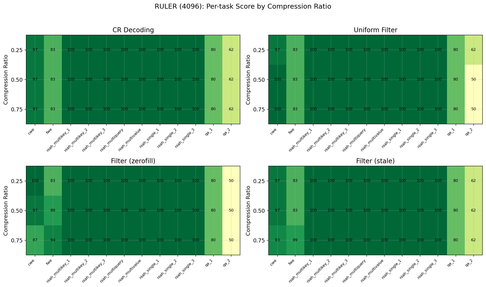
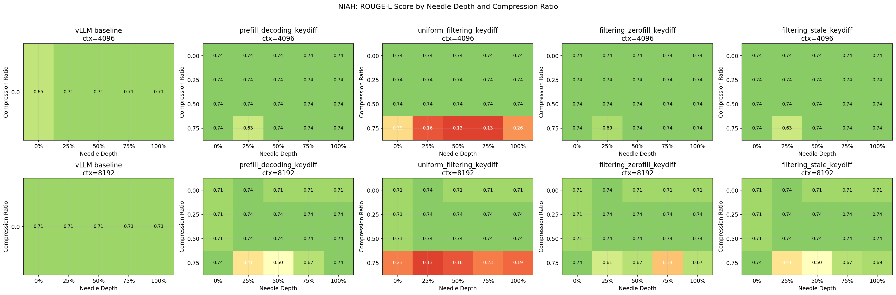

## Evaluation Setup

**Model:** `Qwen/Qwen3-8B` — `flash_attention_2`, no quantization

#### Methods Under Test

Four decoding-phase compression variants using **KeyDiffPress** as base scorer:

#### RULER ([notebook 06](../notebooks/06_kvpress_eval_decoding.ipynb))

[kvpress evaluation framework](https://github.com/NVIDIA/kvpress/tree/main/evaluation) —
same setup as the [kvpress leaderboard](https://huggingface.co/spaces/nvidia/kvpress-leaderboard).

- [RULER](https://huggingface.co/datasets/simonjegou/ruler) 4096, string match, compression ratios: 0.25, 0.50, 0.75

| Registry Name | Press |
|---------------|-------|
| `compression_ratio_decoding_keydiff` | `CompressionRatioDecodingPress(base_press=KeyDiffPress())` |
| `uniform_filtering_keydiff` | `UniformFilteringPress(base_press=KeyDiffPress())` |
| `filtering_zerofill_keydiff` | `FilteringPress(base_press=KeyDiffPress())` |
| `filtering_stale_keydiff` | `FilteringPress(base_press=KeyDiffPress(), fill_padding=False)` |

New presses and evaluation entries added by: https://github.com/NVIDIA/kvpress/pull/258

#### NIAH ([notebook 02](../notebooks/02_kvpress_niah.ipynb))

Custom loop, compared against vLLM baseline (notebook 04).

- [Paul Graham Essays](https://huggingface.co/datasets/alessiodevoto/paul_graham_essays), ROUGE-L
- Compression ratios: 0.0, 0.25, 0.50, 0.75 — depths: 0/25/50/75/100% — context: 4096, 8192

| Config Name | Press |
|-------------|-------|
| `prefill_decoding_keydiff` | `PrefillDecodingPress(KeyDiffPress(cr), CompressionRatioDecodingPress(KeyDiffPress(), cr))` |
| `uniform_filtering_keydiff` | `PrefillDecodingPress(KeyDiffPress(cr), UniformFilteringPress(KeyDiffPress(), cr))` |
| `filtering_zerofill_keydiff` | `PrefillDecodingPress(KeyDiffPress(cr), FilteringPress(KeyDiffPress(), cr))` |
| `filtering_stale_keydiff` | `PrefillDecodingPress(KeyDiffPress(cr), FilteringPress(KeyDiffPress(), cr, fill_padding=False))` |

##### vLLM baseline ([notebook 04](../notebooks/04_vllm_niah.ipynb))

No compression — vLLM with PagedAttention, same model/dataset/depths/contexts as notebook 02.
Results compared in [notebook 05](../notebooks/05_compare_results.ipynb).

